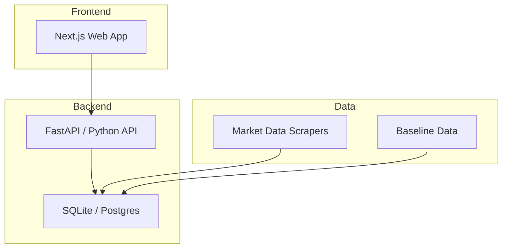

# CONTEXT — JetScope

## 目的

航空可持续燃料（SAF）市场数据平台。聚合 EU ETS、CORSIA、航空公司 SAF 采购数据，提供市场分析和趋势预测。

## 当前阶段

- [x] 规划中
- [x] 开发中
- [ ] 可用/维护中
- [ ] 归档

## 痛点

1. 产品代码和工具代码曾混在同一个 repo（已解决：tools/automation 已剥离）
2. 前端组件缺少测试覆盖
3. API 层缺少统一错误处理
4. 数据管道没有端到端验证

## 架构概览

## 约束

- 不允许硬编码路径
- 产品代码只在 `projects/jetscope` 开发
- CI: GitHub Actions (maintenance-gates, ci, codeql)
- 部署需要明确批准

## 开发需求（下一步）

- [ ] 前端组件测试补全
- [ ] API 统一错误处理中间件
- [ ] 数据管道端到端测试
- [ ] 中文用户界面完善

## 技术栈

- 语言: TypeScript (前端), Python (后端)
- 框架: Next.js, FastAPI
- 测试: Vitest (前端), pytest (后端)
- CI: GitHub Actions
- 数据库: SQLite (dev), PostgreSQL (prod)

## 相关 Repo

- `wyl2607/automation` — 开发工具和治理
- `wyl2607/esg-research-toolkit` — ESG 研究工具（数据源之一）
