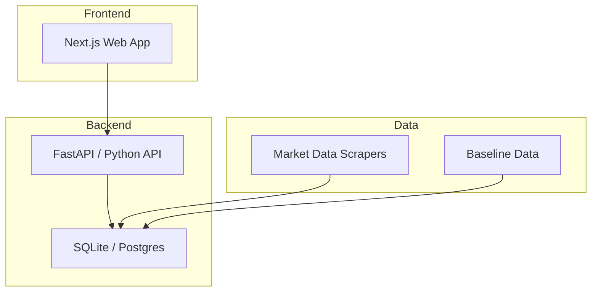

# CONTEXT — JetScope

## 目的

航空燃料（SAF）、可再生电网（grid）、住宅供热转型（heat）三域决策情报平台。聚合 EU ETS、市场价格、政策/基线假设与场景参数，提供跨域比较分析与趋势洞察。

## 当前阶段

- [x] 规划中
- [x] 开发中
- [ ] 可用/维护中
- [ ] 归档

## 痛点

1. 产品代码和工具代码曾混在同一个 repo（已解决：tools/automation 已剥离）
2. 前端组件缺少测试覆盖
3. API 层缺少统一错误处理
4. 数据管道没有端到端验证

## 架构概览

## 约束

- 不允许硬编码路径
- 产品代码只在 `projects/jetscope` 开发
- CI: GitHub Actions (maintenance-gates, ci, codeql)
- 部署需要明确批准

## 开发需求（下一步）

- [ ] integration/cherry-pick review
- [ ] browser QA（关键页面与图表渲染）
- [ ] API 文档与代码合同漂移审查
- [ ] data pipeline E2E（含市场快照/历史种子）
- [ ] docs/readme surface 与产品边界一致性

当前主干覆盖说明：

- 当前本地分支已含 `grid-parity*` 与 `heat-parity*` 路由覆盖，且工作区 `preferences`/`scenarios` 写路由具备 `x-admin-token` 合同与隔离测试。
- 产品叙事已同步到 SAF + grid + heat 并以 demo/proxy/baseline 数据来源为保守口径，不对外宣称实时付费源。

## 技术栈

- 语言: TypeScript (前端), Python (后端)
- 框架: Next.js, FastAPI
- 测试: Vitest (前端), pytest (后端)
- CI: GitHub Actions
- 数据库: SQLite (dev), PostgreSQL (prod)

## 相关 Repo

- `wyl2607/automation` — 开发工具和治理
- `wyl2607/esg-research-toolkit` — ESG 研究工具（数据源之一）
